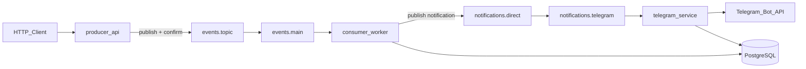

# EventRelay

Event-driven microservices monorepo (NestJS + RabbitMQ + Telegram): publish domain events, process them idempotently, deliver notifications via Telegram Bot API.

## Architecture



| Service | Port | Responsibility |
|---------|------|----------------|
| **producer** | 3001 | HTTP API, publish domain events with publisher confirms |
| **consumer** | 3002 | Consume events, idempotent processing (PostgreSQL), fan-out to notifications |
| **telegram** | 3003 | Consume notifications, send via Bot API, dedup in PostgreSQL |

## Quick start (Docker)

1. Copy env and set Telegram credentials:

```bash
cp .env.example .env
# TELEGRAM_BOT_TOKEN=... from @BotFather
# TELEGRAM_DEFAULT_CHAT_ID=... your chat id
```

2. Start stack:

```bash
docker compose up --build
```

3. Publish an event:

```bash
curl -s -X POST http://localhost:3001/api/v1/events \
  -H 'Content-Type: application/json' \
  -d '{"type":"user.registered","payload":{"userId":"42","email":"u@example.com"}}'
```

4. Swagger:
   - Producer: http://localhost:3001/api/docs
   - Telegram: http://localhost:3003/api/docs

## Local development (without Docker)

```bash
npm install
# Start RabbitMQ + Postgres locally, then:
npm run start:consumer:dev
npm run start:telegram:dev
npm run start:producer:dev
```

## Guarantees and edge cases

### Delivery semantics
- RabbitMQ provides **at-least-once** delivery.
- **Idempotency** is enforced in PostgreSQL:
  - `processed_events` (consumer) — skip already `completed` events.
  - `sent_notifications` (telegram) — skip duplicate Telegram sends for the same `eventId`.

### Producer
- UUID `eventId` (client-supplied or auto-generated).
- JSON envelope with schema version.
- **Publisher confirms** before HTTP 201.
- Retries with exponential backoff on transient broker errors (`503` if broker unavailable).

### Consumer
- Manual ack after successful processing.
- Transient failures → delayed retry queue (`x-retry-count`, max 5).
- Permanent failures / max retries → **DLQ** (`events.dlq`) via explicit `sendToQueue`.
- Structured logs: `eventId`, `type`, `result`, `durationMs`.

### Telegram
- Handles 429 (`retry_after`), 5xx retries.
- Truncates messages > 4096 chars.
- Invalid token → process fails at startup.
- Invalid `chatId` → permanent error → DLQ.

### DLQ replay (manual)
1. Open RabbitMQ Management: http://localhost:15672 (guest/guest).
2. Inspect `events.dlq` or `notifications.dlq`.
3. Move messages back to main queue only after fixing root cause.

### Trade-off: outbox pattern
Current flow: consumer marks event completed in PG, then publishes notification. A crash between steps can orphan a notification; Telegram idempotency + client retry mitigates this. For strict exactly-once fan-out, add an `outbox` table and a background publisher.

## Tests

```bash
npm test
npm run test:e2e
```

## Project layout

```
apps/producer   — HTTP ingress
apps/consumer   — event processing + notification publish
apps/telegram   — Telegram Bot API adapter
libs/contracts  — DTOs, topology constants
libs/messaging  — amqplib connection, confirms, consumer engine
libs/common     — errors, retry, health helpers
```
